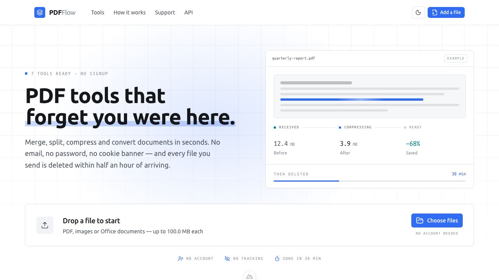

<p align="center">
  
</p>

<h1 align="center">PDFFlow</h1>

<p align="center">
  <strong>Fast, private PDF tools that forget you were here.</strong><br>
  Merge, split, compress, organise and convert documents—without an account,
  tracking, or permanent storage.
</p>

<p align="center">
  <a href="https://github.com/RithyBondeth/PDFFlow/actions/workflows/ci.yml"></a>
  <a href="https://github.com/RithyBondeth/PDFFlow/stargazers"></a>
  <a href="https://github.com/RithyBondeth/PDFFlow/issues"></a>
  
  
</p>

<p align="center">
  <a href="#quick-start"><strong>Run it locally</strong></a>
  ·
  <a href="#features"><strong>Explore the tools</strong></a>
  ·
  <a href="#api"><strong>Use the API</strong></a>
  ·
  <a href="https://github.com/RithyBondeth/PDFFlow"><strong>Star on GitHub ⭐</strong></a>
</p>



## Why PDFFlow?

Most online document tools ask for an account, track how you use them, or leave
you wondering where your files went. PDFFlow is built around a simpler promise:
**upload a document, do the job, download the result, and leave no footprint.**

| Private by default | Useful right away | Honest about your data |
| --- | --- | --- |
| No accounts, session cookies, analytics, or advertising trackers. | Seven working tools cover common PDF and Office workflows. | Inputs are removed after processing; results expire within 30 minutes. |

The interface is responsive, supports light and dark themes, and shows file
requirements and output formats before you upload anything.

## Features

### Ready today

| Tool | What it does | Output |
| --- | --- | --- |
| **Merge PDF** | Combine multiple PDFs in drag-and-drop order | PDF |
| **Split PDF** | Split every page or use explicit page ranges | ZIP |
| **Extract Pages** | Build a new document from selected pages | PDF |
| **Rotate PDF** | Rotate the whole document or selected pages | PDF |
| **Organise Pages** | Reorder, rotate, duplicate and remove pages visually | PDF |
| **Compress PDF** | Choose a compression level and compare file sizes | PDF |
| **Office to PDF** | Convert DOCX, XLSX and PPTX with LibreOffice | PDF |

### On the roadmap

- Watermark and protect PDFs
- Unlock password-protected PDFs with the correct password
- Extract embedded images
- Convert images to PDF
- Render PDF pages as images

The backend serves the operation catalog to the frontend, so the UI never
advertises a tool that the worker cannot run.

## Privacy by design

```text
Upload                  Process                  Download                Delete
  │                        │                         │                      │
  ├─ validate content ────►├─ isolated worker ─────►├─ private job URL ───►│
  └─ random disk name      └─ progress over SSE     └─ no-store response   └─ ≤ 30 min
```

- **No identity to collect.** The browser keeps only a random job UUID in
  memory. A page reload genuinely starts over.
- **No original filename on disk.** Files are stored under generated UUIDs;
  the user-provided name is display-only.
- **No permanent document storage.** The default Docker setup uses a `tmpfs`
  volume. PostgreSQL contains metadata, never document contents.
- **Deletion has a safety net.** Inputs are purged as soon as processing ends.
  A scheduled sweep removes expired results and orphaned files every five
  minutes.
- **Uploads are treated as hostile.** Content signatures, extensions and size
  limits are checked while the file streams in.

Read the full [security model](docs/security.md) for controls, trade-offs and
the deliberate limitations of an anonymous service.

## Architecture

```text
┌──────────────┐       ┌──────────────┐       ┌──────────────┐
│ User browser │──────►│    Nginx     │──────►│    Nuxt 4    │
└──────────────┘ HTTPS │ rate limiting│       │   frontend   │
                       └──────┬───────┘       └──────────────┘
                              │ /api
                       ┌──────▼───────┐
                       │   FastAPI    │
                       └───┬──────┬───┘
                           │      │
                  ┌────────▼─┐  ┌─▼──────────┐
                  │PostgreSQL│  │   Redis    │
                  │ metadata │  │queue+pubsub│
                  └──────────┘  └─────┬──────┘
                                      │
                                ┌─────▼──────┐
                                │   Celery   │
                                │   worker   │
                                └─────┬──────┘
                                      │
                                ┌─────▼──────┐
                                │ temporary │
                                │  storage  │
                                └────────────┘
```

Redis is both the Celery broker and the pub/sub channel for live progress.
That allows API replicas to scale horizontally without breaking the browser's
server-sent event stream. See [architecture.md](docs/architecture.md) for the
decisions behind each component.

### Technology

| Layer | Built with |
| --- | --- |
| Frontend | Nuxt 4, Vue 3, TypeScript, Tailwind CSS v4, Nuxt UI, Pinia |
| API | FastAPI, Pydantic v2, SQLAlchemy 2, Alembic |
| Processing | Celery 5, PyMuPDF, pypdf, Pillow, LibreOffice |
| Data and events | PostgreSQL 16, Redis 7 |
| Infrastructure | Docker Compose, Nginx, Railway-ready services |

## Quick start

### Docker Compose (recommended)

You need [Docker](https://docs.docker.com/get-docker/) with Compose enabled.

```bash
git clone https://github.com/RithyBondeth/PDFFlow.git
cd PDFFlow
cp .env.example .env
docker compose up --build
```

Open **http://localhost:8080**. Interactive API documentation is available at
**http://localhost:8080/docs**.

The migration service applies the database schema before the API and workers
start. Stop the stack with `docker compose down`.

<details>
<summary><strong>Run the services separately for development</strong></summary>

### Backend

```bash
cd backend
python -m venv .venv
.venv/bin/pip install -r requirements-dev.txt
.venv/bin/uvicorn app.main:app --reload
```

### Worker and cleanup scheduler

Redis and PostgreSQL must already be running.

```bash
cd backend
.venv/bin/celery -A app.worker.celery_app.celery_app worker --loglevel=info
```

In another terminal:

```bash
cd backend
.venv/bin/celery -A app.worker.celery_app.celery_app beat --loglevel=info
```

### Frontend

```bash
cd frontend
npm install
npm run dev
```

</details>

## API

PDFFlow's web interface is a client of the same REST API available to your own
scripts and applications. There are no keys or accounts.

| Method | Endpoint | Purpose |
| --- | --- | --- |
| `GET` | `/api/operations` | Discover available tools and file requirements |
| `POST` | `/api/upload` | Upload one or more validated files |
| `POST` | `/api/jobs/create` | Queue an operation |
| `GET` | `/api/jobs/{id}/events` | Follow progress over server-sent events |
| `GET` | `/api/jobs/{id}/status` | Poll lightweight job status |
| `GET` | `/api/download/{id}` | Download the completed result |
| `GET` | `/api/health` | Check API, PostgreSQL and Redis health |

Errors use a stable envelope and include a request ID without exposing paths,
stack traces or stored filenames:

```json
{
  "error": {
    "code": "file_too_large",
    "message": "File exceeds the 100 MB limit.",
    "requestId": "a1b2c3d4e5f6"
  }
}
```

Swagger UI is served at `/docs`, ReDoc at `/redoc`, and the OpenAPI schema at
`/openapi.json`.

## Configuration

Every setting has a development default. Copy [`.env.example`](.env.example)
to `.env` and adjust what your environment needs.

| Variable | Default | Purpose |
| --- | --- | --- |
| `HTTP_PORT` | `8080` | Public Nginx port |
| `DATABASE_URL` | Local PostgreSQL | SQLAlchemy connection URL |
| `REDIS_URL` | `redis://redis:6379/0` | Queue, results and progress events |
| `STORAGE_ROOT` | `/data/storage` | Temporary upload/result root |
| `MAX_UPLOAD_BYTES` | `104857600` | Per-file streaming limit |
| `MAX_FILES_PER_JOB` | `25` | Files accepted by one job |
| `FILE_TTL_MINUTES` | `30` | Maximum result lifetime |
| `CLEANUP_INTERVAL_SECONDS` | `300` | Expired-file sweep interval |
| `CORS_ORIGINS` | Localhost | Allowed browser origins |
| `TRUSTED_PROXIES` | Private networks | Proxies allowed to set forwarding headers |

## Testing

```bash
# Backend
cd backend && .venv/bin/pytest

# Frontend
cd frontend && npm test

# Frontend type checking and production build
cd frontend && npm run typecheck && npm run build
```

The backend suite covers the complete upload → job → download path, storage
escape attempts, streaming limits, MIME mismatches, page ranges, OOXML package
validation, document operations, safe errors, rate limiting and cleanup. The
frontend suite covers the workspace state, API reference, page organiser and
formatting utilities. CI also builds the production containers.

## Project structure

```text
PDFFlow/
├── frontend/                  Nuxt application and server proxy
│   ├── app/components/        Upload, tools, jobs and page organiser UI
│   ├── app/pages/             Landing page, workspace and API reference
│   └── tests/                 Vitest suite
├── backend/
│   ├── app/api/routes/        Health, uploads, jobs and downloads
│   ├── app/services/          Validation, storage, events and rate limiting
│   ├── app/worker/            Celery dispatcher and document operations
│   └── tests/                 Pytest suite
├── database/migrations/       Alembic migrations
├── infrastructure/            Compose and Nginx production configuration
├── docs/                      Architecture, security and deployment guides
└── compose.yaml               Local full-stack entry point
```

## Deployment

- **Railway Hobby:** follow the step-by-step [Railway deployment guide](docs/railway.md).
- **Docker host:** combine the development and production Compose files as
  described in [`infrastructure/docker-compose.prod.yml`](infrastructure/docker-compose.prod.yml).
- **TLS:** the production Nginx configuration supports Let's Encrypt bootstrap
  and renewal through the included Certbot services.

Production deployments should set a strong PostgreSQL password, use the exact
public origin for CORS, narrow trusted proxy ranges, provide persistent
temporary capacity, and run **exactly one** Celery beat replica.

## Contributing

Contributions, bug reports and thoughtful feature ideas are welcome.

1. Fork the repository and create a focused feature branch.
2. Add or update tests with your change.
3. Run the relevant test and build commands above.
4. Open a pull request explaining the user-facing result.

For larger changes, [open an issue](https://github.com/RithyBondeth/PDFFlow/issues/new)
first so the approach can be discussed before implementation.

## Help PDFFlow grow

If PDFFlow is useful to you, the easiest way to support it is to
[**star the repository**](https://github.com/RithyBondeth/PDFFlow) and share it
with someone who works with documents. A star helps other people discover the
project—and gives me a strong signal to keep building the next tool. ⭐

<p align="center">
  <a href="https://github.com/RithyBondeth/PDFFlow"><strong>⭐ Star PDFFlow</strong></a>
  ·
  <a href="https://github.com/RithyBondeth"><strong>Follow @RithyBondeth</strong></a>
</p>
